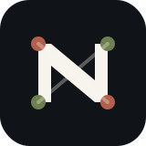
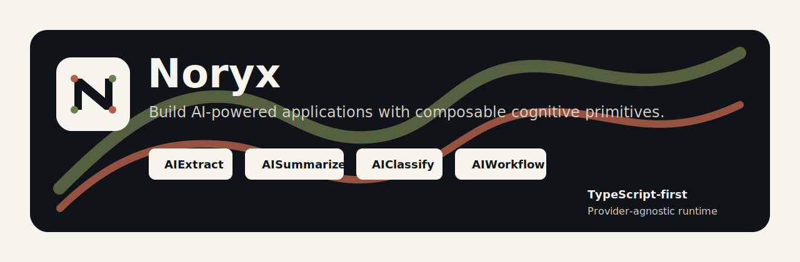
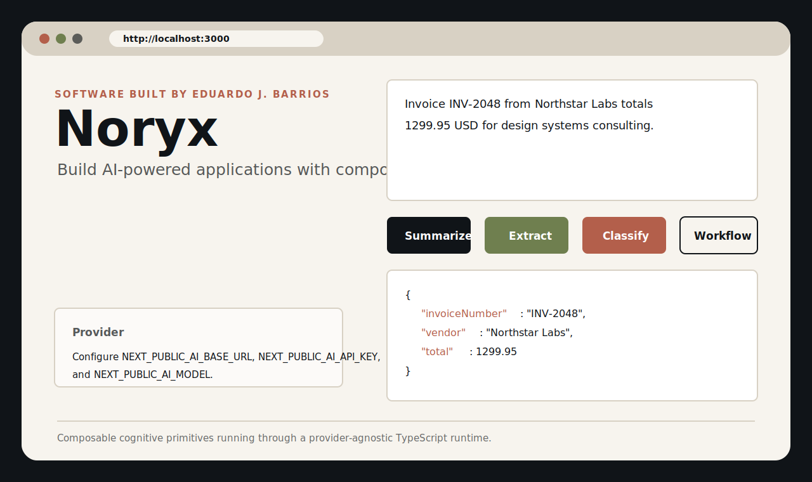

<p align="center">
  
</p>

<h1 align="center">Noryx</h1>

<p align="center">
  <strong><em>React made UI composable. Noryx makes cognition composable.</em></strong>
</p>

<p align="center">
  <strong>Build AI-powered applications with composable cognitive primitives.</strong>
</p>

<p align="center">
  <a href="https://github.com/edujbarrios/Noryx/actions/workflows/ci.yml"></a>
  <a href="https://github.com/edujbarrios/Noryx/blob/main/LICENSE"></a>
  
  
</p>

<p align="center">
  
</p>

Noryx is a TypeScript-first framework for building AI applications through reusable, composable, provider-agnostic cognitive primitives. It is not another LLM wrapper or chatbot kit. Noryx is a foundation for cognitive applications.

Target composition model:

```tsx
<AIWorkflow>
  <AIExtract schema={InvoiceSchema} />
  <AIClassify labels={["invoice", "support", "legal"]} />
  <AISummarize maxWords={80} />
</AIWorkflow>
```

Software built by Eduardo J. Barrios.

## Contents

- [Why Noryx](#why-noryx)
- [Status](#status)
- [Quick Start](#quick-start)
- [Provider Configuration](#provider-configuration)
- [Create a Primitive](#create-a-primitive)
- [Runtime Example](#runtime-example)
- [Architecture](#architecture)
- [Packages](#packages)
- [Development](#development)
- [Roadmap](#roadmap)

## Why Noryx

Most AI libraries start with provider calls, prompts, or chat abstractions. Noryx starts with composable behavior.

```txt
Applications
  -> React Bindings
  -> Workflow Engine
  -> Primitive Runtime
  -> Provider Layer
  -> LLM APIs
```

The core framework does not know about OpenAI, React components, or built-in primitives. Every primitive is registered dynamically, and built-ins use the same plugin path that third-party primitives use.

## Status

Noryx is an early framework scaffold with a working runtime, provider contract, workflow engine, React binding factories, OpenAI-compatible provider, built-in primitives, and a Next.js playground.

It is ready for experimentation and architecture iteration, not production use yet.

## Quick Start

```bash
git clone https://github.com/edujbarrios/Noryx.git
cd Noryx
corepack enable
corepack pnpm install
corepack pnpm build
corepack pnpm dev
```

Open the playground:

<p align="center">
  <a href="http://localhost:3000">
    
  </a>
</p>

Local URL: <http://localhost:3000>

You can also run the playground directly:

```bash
corepack pnpm --filter @noryx/playground dev
```

## Provider Configuration

The first provider adapter targets OpenAI-compatible APIs:

```bash
NEXT_PUBLIC_AI_BASE_URL=https://api.openai.com/v1
NEXT_PUBLIC_AI_API_KEY=...
NEXT_PUBLIC_AI_MODEL=gpt-4.1
```

The same adapter shape can target OpenAI, OpenRouter, DeepSeek, Groq, Together, Fireworks, Azure OpenAI, LM Studio, LocalAI, or Ollama OpenAI mode by changing configuration.

## Create a Primitive

Primitives can use prompts internally, but the application code does not have to pass raw prompts around. A primitive packages the prompt, input schema, output schema, provider call, and validation rules into a reusable typed unit.

In this example, the `system` message is the AI instruction, while Zod defines the exact shape Noryx expects back from the provider.

```ts
import { createPrimitive } from "@noryx/core";
import { z } from "zod";

const SentimentSchema = z.object({
  sentiment: z.enum(["positive", "neutral", "negative"])
});

export const SentimentPrimitive = createPrimitive({
  name: "sentiment",
  input: z.object({
    text: z.string()
  }),
  output: SentimentSchema,
  async execute(ctx, input) {
    if (!ctx.provider) {
      throw new Error("Sentiment requires a provider.");
    }

    return ctx.provider.extract({
      schema: SentimentSchema,
      messages: [
        {
          role: "system",
          content:
            "Classify the sentiment of the user text. Return only JSON matching the schema."
        },
        {
          role: "user",
          content: input.text
        }
      ]
    });
  }
});
```

## Runtime Example

```ts
import { createRuntime } from "@noryx/runtime";
import { createOpenAICompatibleProvider } from "@noryx/openai-compatible";
import { AISummarizePrimitive } from "@noryx/primitive-summarize";

const runtime = createRuntime({
  provider: createOpenAICompatibleProvider({
    apiKey: process.env.API_KEY,
    baseUrl: process.env.BASE_URL,
    model: "gpt-4.1"
  })
});

runtime.registerPrimitive(AISummarizePrimitive);

const result = await runtime.execute(AISummarizePrimitive, {
  text: "Long text...",
  format: "paragraph",
  maxWords: 80
});

console.log(result.summary);
```

## Architecture

Noryx is designed around isolation and extensibility:

- `@noryx/core` defines contracts only.
- `@noryx/runtime` validates, registers, executes, emits lifecycle events, and runs middleware.
- `@noryx/react` creates React hooks and components from primitives.
- `@noryx/workflows` executes primitives as workflow nodes.
- Provider adapters own vendor-specific details.
- Built-in primitives are plugins, not privileged internals.

Read the full design in [docs/architecture.md](docs/architecture.md).

## Packages

```txt
apps/playground
packages/core
packages/runtime
packages/react
packages/providers/openai-compatible
packages/workflows
packages/memory
packages/tools
packages/primitives/chat
packages/primitives/summarize
packages/primitives/extract
packages/primitives/classify
```

## Development

```bash
corepack pnpm install
corepack pnpm typecheck
corepack pnpm build
```

Useful commands:

```bash
corepack pnpm --filter @noryx/playground dev
corepack pnpm --filter @noryx/core typecheck
corepack pnpm --filter @noryx/runtime build
```

## Roadmap

- Streaming-first React hooks
- Primitive marketplace metadata
- Typed workflow graph compilation
- Provider capability negotiation
- Middleware for tracing, caching, retries, permissions, and rate limits
- Additional memory stores
- Conformance tests for third-party primitive plugins

## Repository

- GitHub: <https://github.com/edujbarrios/Noryx>
- Issues: <https://github.com/edujbarrios/Noryx/issues>
